<div align="center">

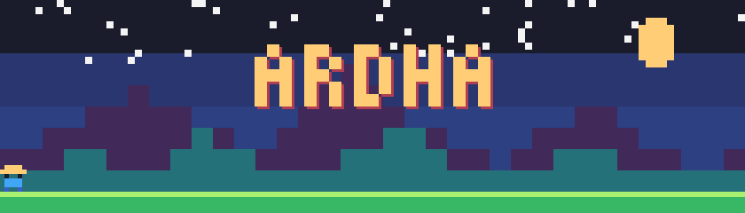

### `> PLAYER 1 : DHUHA ARDHA SAPUTRA (ARDHA)`
**Web Developer by day &nbsp;·&nbsp; Pixel Artist in training &nbsp;·&nbsp; Future Game Dev**

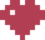   &nbsp; 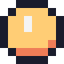  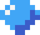


</div>

## 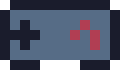 PLAYER PROFILE

| | |
|---|---|
| **Class** | Fullstack Web Developer |
| **Guild** | PT Ungaran Sari Garments (IT PST Team) |
| **Home Town** | Semarang, Indonesia 🇮🇩 |
| **Main Quest** | Build my own game |
| **Side Quest** | Open my own art gallery |
| **Looking For** | Co-op partners for a game project |


## 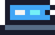 DAY JOB: THE WEB DEV DUNGEON

I build and maintain internal systems for a garment company: asset and service management on **Laravel**, plus a PHP-based production digital system. Solid roots in **Laravel / PHP / SQL / Linux**, with frontend in good old vanilla JS and jQuery.

```php
<?php
$ardha = [
    'role'    => 'Fullstack Web Developer',
    'stack'   => ['Laravel', 'PHP', 'SQL', 'Linux', 'JavaScript', 'jQuery'],
    'leveling' => ['Backend', 'Pixel Art', 'Lua'],
];
```


##  XP BARS

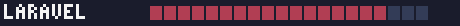<br>
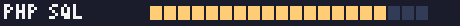<br>
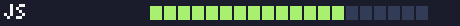<br>
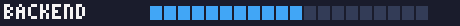<br>
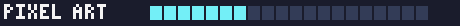<br>
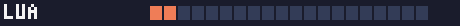

> Bars are just for fun. Edit the numbers in `assets/` as you level up!


## 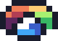 CURRENTLY LEARNING

-  **Backend**: going deeper on architecture, APIs and databases
-  **Pixel Art**: sprites, palettes, tiny animations
- 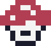 **Lua**: the language for my first real game
-  **Game dev**: designing the world I want to build

##  THE DREAM

<div align="center">


*A game I made myself, filled with art I drew myself,*
*and a gallery wall to show it all.*
</div>


## 🖼️ PIXEL GALLERY

> Work in progress. Drop your pixel art into `gallery/` and add it below.

| | | |
|:-:|:-:|:-:|
|  |  |  |
| `heart.png` | `sword.png` | `gem.png` |
|  |  |  |
| `mushroom.png` | `potion.png` | `coin.png` |

<!-- Replace the icons above with your own work, for example:
 -->


## 🤝 CO-OP MODE

I'm looking for people to team up with on a **game project**, and for help learning **Lua**. If you make games, draw pixels, or just like Lua, say hi!

<div align="center">

[](https://twitter.com/DudangnotKool)

  

`INSERT COIN TO CONTINUE`
</div>
