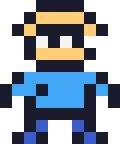
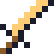
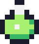

<!-- ALT DESIGN: "Save screen / RPG menu" style. Needs the same assets/ folder as the first README. -->
<div align="center">



# ★ ARDHA'S SAVE FILE ★
`LV.?? WEB DEVELOPER` &nbsp;|&nbsp; `CLASS: FULLSTACK` &nbsp;|&nbsp; `LOCATION: SEMARANG`


</div>

```text
┌──────────────── DIALOGUE ────────────────┐
│ ARDHA: "Hi! I build web systems all day, │
│ then draw pixels and learn Lua at night. │
│ One day I'll ship my own game and hang   │
│ my art in my own gallery."               │
└──────────────────────────────────────────┘
```

##  EQUIPMENT
| Slot | Item |
|---|---|
| Main weapon | Laravel / PHP |
| Magic book | SQL + Linux |
| Utility | JavaScript, jQuery |
| Crafting kit | Pixel art tools |

##  INVENTORY (LEARNING)
`[ Backend ]` `[ Pixel Art ]` `[ Lua ]` `[ Game Design ]`

##  QUEST LOG
- [x] Become a fullstack web developer
- [ ] Master backend
- [ ] Draw my first full sprite sheet
- [ ] Learn Lua and build a small game
- [ ] **FINAL BOSS:** open my own art gallery

<div align="center">


**PARTY SLOT 2 IS OPEN:** looking for game project collaborators!<br>
[](https://twitter.com/DudangnotKool)

`PRESS START`
</div>
